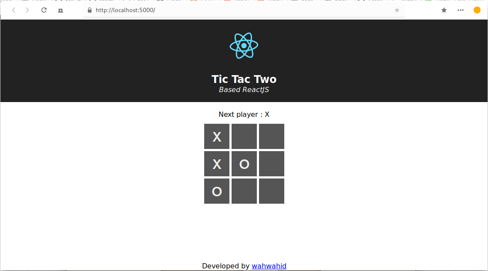
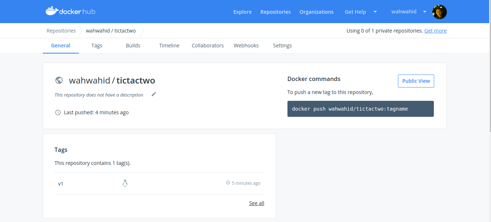
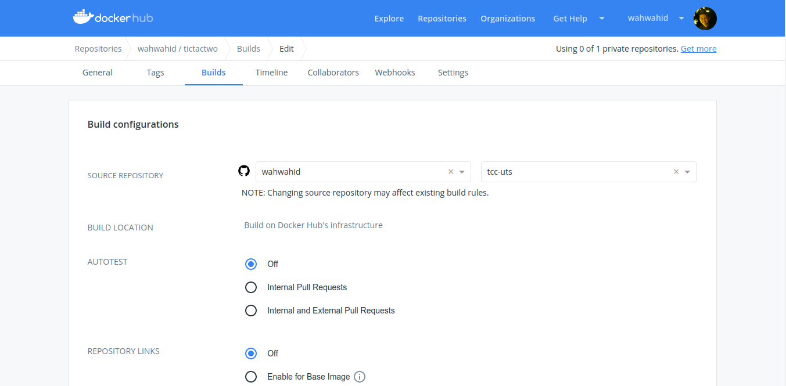
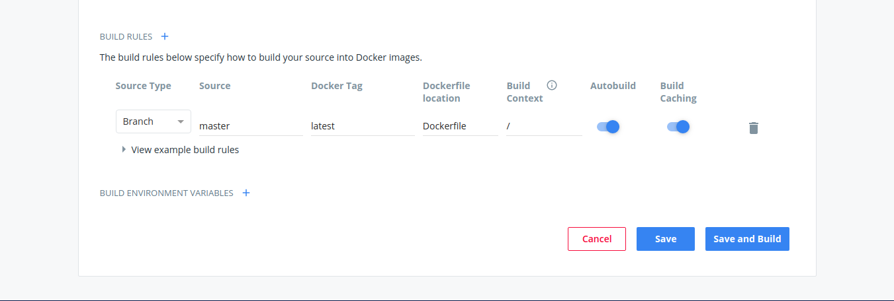

# UTS
Docker Aplikasi TicTacToe

## Membuat Docker File
```php
# Mengambil base dari node:alpine
FROM node:alpine

# Menginstall git dan openssh
RUN apk add --no-cache bash git openssh

# Mengclone source code aplikasi tictactwo dari gitlab
# Berpindah ke direktori aktif ke tictactwo
# Menginstall dependency dari aplikasi dan membuild aplikasi untuk environtment produksi
# Menginstall modul node.js "serve" untuk menyajikan aplikasi (default ke port 5000)
RUN git clone https://gitlab.com/wahwahid/tictactwo.git /tictactwo \
    && cd /tictactwo \
    && npm install && npm run build \
    && npm install -g serve

# Mengekspose port 5000
EXPOSE 5000

# Menjalankan serve
CMD ["serve", "-s", "/tictactwo/build"]
```

## Build Docker Image
```bash
docker build -t wahwahid/tictactwo:v1 .

ending build context to Docker daemon  40.45kB
Step 1/5 : FROM node:alpine
 ---> 4eb3543f9812
Step 2/5 : RUN apk add --no-cache bash git openssh
 ---> Using cache
 ---> 345945207a72
Step 3/5 : RUN git clone https://gitlab.com/wahwahid/tictactwo.git /tictactwo     && cd /tictactwo     && npm install && npm run build     && npm install -g serve
 ---> Running in f2da33ca01f4
...
Removing intermediate container f2da33ca01f4
 ---> 4c4424a776d1
Step 4/5 : EXPOSE 5000
 ---> Running in da64c9f20573
Removing intermediate container da64c9f20573
 ---> b7fa48b16137
Step 5/5 : CMD ["serve", "-s", "build"]
 ---> Running in ed19aa8242a0
Removing intermediate container ed19aa8242a0
 ---> 1a00ec7e399b
Successfully built 1a00ec7e399b
Successfully tagged wahwahid/tictactwo:v1
```

## Mengecek Docker Image
```bash
docker images

REPOSITORY              TAG                 IMAGE ID            CREATED             SIZE
wahwahid/tictactwo      v1                  1a00ec7e399b        10 seconds ago      296MB
```

## Menjalankan Docker Container
```bash
docker run -d -p 5000:5000 --name="uts" wahwahid/tictactwo:v1

7c036acbc31a3e5d9bcf3630f54d41b0d2e7e856bfe34a83747c18b74e2c108f
```

## Mengecek Container yang berjalan
```bash
docker ps                                                    
CONTAINER ID        IMAGE                   COMMAND                  CREATED             STATUS              PORTS                    NAMES
7c036acbc31a        wahwahid/tictactwo:v1   "docker-entrypoint.s…"   2 minutes ago       Up 2 minutes        0.0.0.0:5000->5000/tcp   uts
```

## Mengecek aplikasi melalui browser


## Login ke dockerhub
```
docker login   

Login with your Docker ID to push and pull images from Docker Hub. If you don't have a Docker ID, head over to https://hub.docker.com to create one.
Username: 
Password: 
WARNING! Your password will be stored unencrypted in /root/.docker/config.json.
Configure a credential helper to remove this warning. See
https://docs.docker.com/engine/reference/commandline/login/#credentials-store

Login Succeeded
```

## Push Docker Image ke dockerhub
```bash
docker push wahwahid/tictactwo:v1  

The push refers to repository [docker.io/wahwahid/tictactwo]
f0ac89f7dbef: Pushed 
7a3776584b2f: Pushed 
5c64fceec97e: Mounted from library/node 
8d6db5aa8555: Mounted from library/node 
8e280661aee3: Mounted from library/node 
77cae8ab23bf: Mounted from library/node 
v1: digest: sha256:b9036962d0c117557e01693e0c24570c4cab4b5734c51e50aedd98324a14ed5e size: 1582
```

## Cek di dockerhub


## Link ke github
Hal ini dilakukan agar docker image di dockerhub bisa terupdate otomatis tanpa perintah docker push, hanya cukup push ke github

